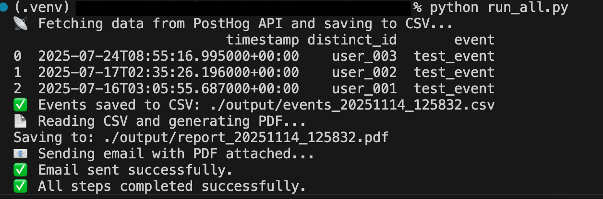
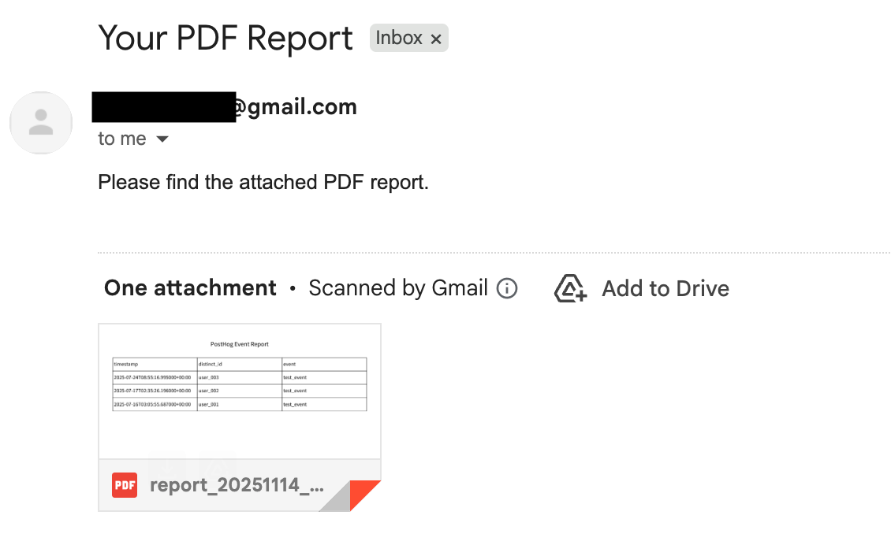
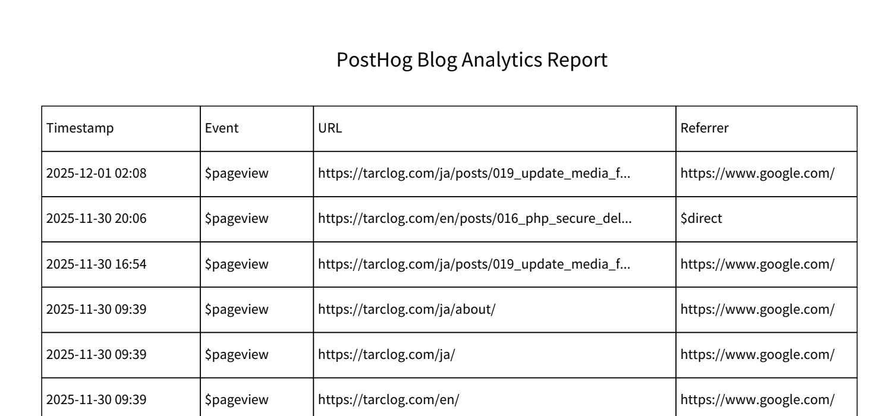
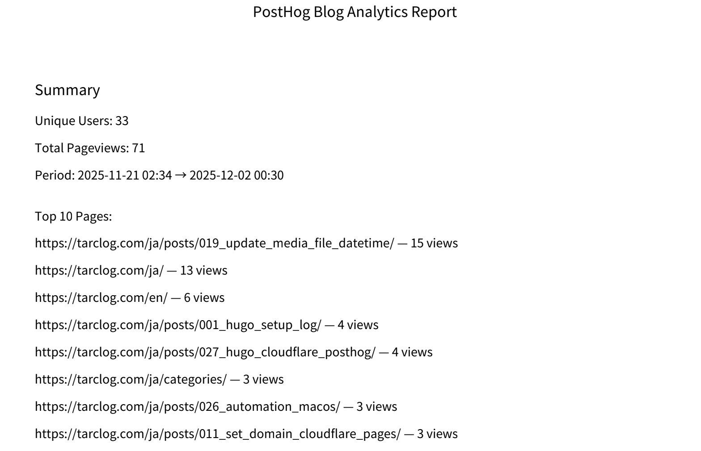

# PostHog Event Automation Tool

## 📌 Overview
This tool automates the following steps:
1. Fetch events from PostHog API
2. Save data as CSV
3. Generate a multilingual PDF report using fpdf2
4. Send the report via email

Built for demo and portfolio purposes.


## ⚙️ Setup

1. Clone Repository
```bash
git clone https://github.com/lat35n-hrt/posthog_api.git
cd posthog_api
```

2. Install Dependencies

```bash
pip install -r requirements.txt
```

3. Configure .env
Use .env.example as a starting point:

```bash
cp .env.example .env
```

Set the following values:

API Keys: POSTHOG_API_KEY, POSTHOG_PERSONAL_API_KEY

Email Settings: EMAIL_ADDRESS, EMAIL_PASSWORD, TO_ADDRESS

Font & Output: FONT_PATH, PDF_PATH, etc.

⚠️ Font not included. Download NotoSansJP from Google Fonts

## 🚀 Run All Steps
```bash
python run_all.py
```

Expected steps:

✅ CSV created: ./output/events_yyyymmdd_hhmmss.csv

📄 PDF generated: ./output/report_yyyymmdd_hhmmss.pdf

📧 Email sent with PDF attached


## 🧪 For Standalone Feature Testing
Use scripts in sandbox/ for unit-level testing:

````bash
cd sandbox/
python send_email_example.py
````

The `sandbox/` directory contains early standalone scripts created before
extracting the stable v1 pipeline. It is not part of the main workflow.


More details: sandbox/README_example.md

## 📎 Notes
.gitignore excludes output/, *.csv and *.pdf

Designed for learning, demo, and reproducible reporting

Easy to expand: plug-in style architecture


## 📸 Screenshots
1. Triggering the PDF generation & email delivery

Below is the exact command execution that triggers the PostHog → PDF → Mail pipeline.




2. Delivered email with PDF attachment

The system successfully delivered the generated PDF to the test mailbox.




## v1 Directory Split and Path Stability Notes

To prepare for the production-oriented implementation (v2), the project has been reorganized so that the
initial Proof-of-Concept (v1) is kept isolated under its own directory:

```bash
posthog_api/
├── v1_generic_events/ # PoC: basic PostHog → CSV → PDF → Email pipeline
├── v2_blog/ # Production-oriented blog integration (in progress)
└── ...
```

The goal of the v1 split is:

- to verify the minimal functional pipeline in a clean, controlled environment
- to prevent early v2 development from being affected by PoC-level experimental code
- to ensure the path behavior is stable when executed from different environments
  (local CLI, cron, CI, or future server-side execution)

# Developer notes

After moving run_all.py and related scripts into v1_generic_events/,
the original relative FONT_PATH (./fonts/...) no longer resolved correctly
when executing from the project root.

This fix ensures FONT_PATH is constructed as:

    BASE_DIR + REL_FONT_PATH

allowing both:
  - `cd v1_generic_events && python run_all.py`
  - `python v1_generic_events/run_all.py`

to work reliably without modifying existing .env values or directory structure.

This is a minimal and safe fix that restores original behavior.


# v2_blog: Hugo Blog Access Tracking Pipeline

The v2_blog/ directory contains the second-stage implementation of this project, focused on tracking page access events from a Hugo-generated blog using PostHog.

## Purpose

Track real blog access events (pageviews, page leaves, autocapture, etc.)

Export recent events to CSV

Generate a PDF access report

Send the report via email for monitoring or personal analytics

Reuse the same .env configuration used by v1_generic_events/

This version is intended for real-world usage with your Hugo blog in production.

## How the blog tracking works

Your Hugo site includes a PostHog snippet injected into the HTML template.
This snippet collects page-level events such as:

$pageview

$pageleave

$autocapture

These events include useful properties like:

$current_url

$referrer

(Optional) $title — but my current snippet does not send it, which is why the title column remains empty.

## Event filtering (same .env shared across v1 / v2 / sandbox)

The same .env is used across:

```bash
sandbox/
v1_generic_events/
v2_blog/
```
You switch the active event type manually using:

```python
#POSTHOG_FILTER_EVENT = test_event
POSTHOG_FILTER_EVENT = $pageview
```

This allows:

v1 PoC testing
→ use test_event or any custom event

v2 blog analytics
→ use $pageview

## Why the "title" column is hidden

Your Hugo + PostHog snippet currently does not send the $title property.
Therefore, all PostHog events contain:

```python
"title": ""
```

Because of this, the pipeline keeps the column internally but hides it from the final report until the snippet is updated to send titles explicitly.


## v2 Blog Analytics Report

The v2_blog pipeline generates a consolidated analytics report (CSV + PDF) using PostHog page-view data.

### Table section:




### Analytics Summary (v2_blog)

The v2_blog version adds a lightweight analytics summary on top of the raw PostHog event export.

After fetching blog page-view events ($pageview), the system computes:

Unique Users
Number of distinct visitors (distinct_id).

Total Pageviews
Count of all $pageview events in the selected window.

Period
First and last timestamps found in the dataset, formatted as
YYYY-MM-DD HH:MM.

Top Pages
The most visited URLs (based on $current_url), ranked by frequency.

These metrics appear at the top of the PDF report, followed by the raw event table.


